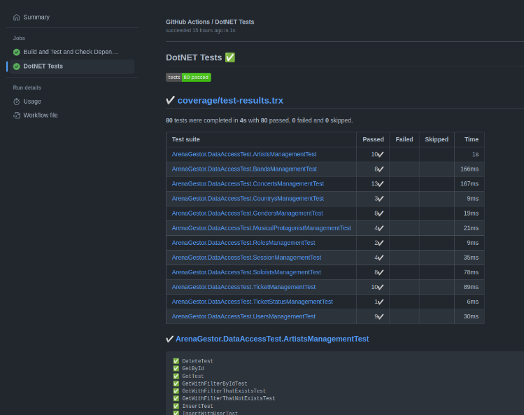
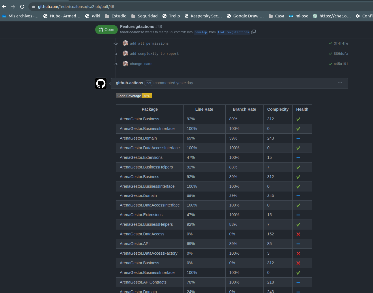
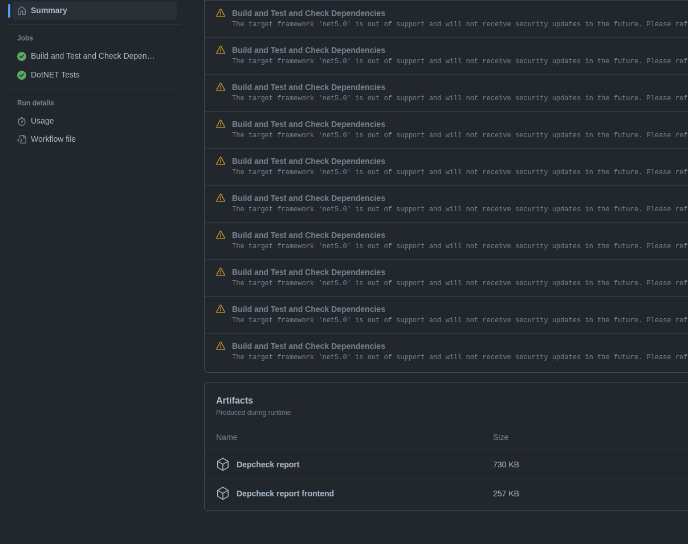
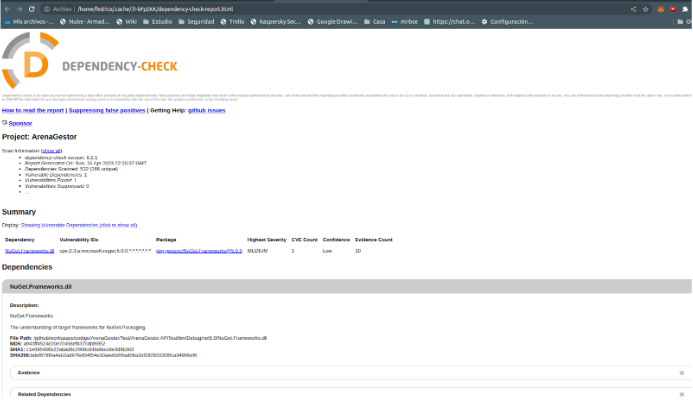
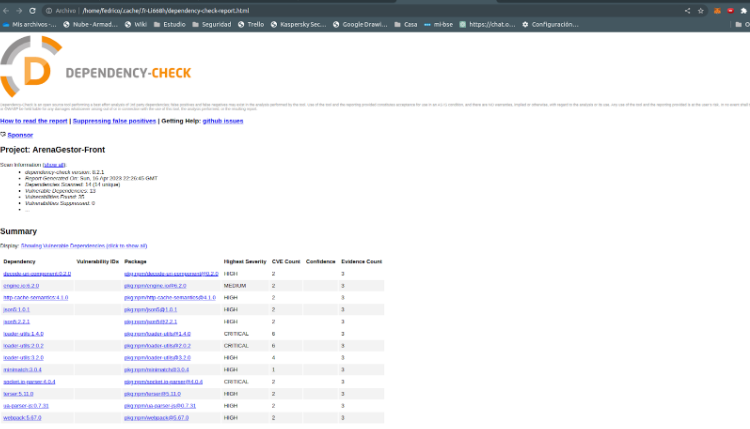

# Configuración del pipeline y su vínculo con el tablero

Antes de comenzar a crear un pipeline, es importante tener una comprensión básica de cómo funciona GitHub Actions. 
Los conceptos clave que debes conocer son:
* Workflow: Es el flujo de trabajo completo que se ejecuta en respuesta a un evento específico (por ejemplo, un push o pull request).
* Job: Es un trabajo específico dentro de un flujo de trabajo, que consiste en una o más tareas.
* Acción: Es un conjunto de tareas predefinidas que se pueden usar en un trabajo.
* Step: Son las tareas predefinidas mencionadas anteriormente.

Utilizaremos esta herramienta para automatizar la mayor cantidad de trabajo que podamos, por lo que se irá modificando a medida que avancemos en el proyecto. En nuestro tablero actual tenemos las siguientes columnas:
* Test Cases Implementation
* Application Implementation
* Testing Automation tools
* Exploratory testing
* Refactoring
* Review
Nuestro pipeline lo tenemos configurado para que corra en el paso Testing Automation Tools.

La configuración del mismo se basa en un archivo YAML que representa el flujo de trabajo, el mismo contiene lo siguiente:


```yaml
name: .NET

on:
  push:
    branches: [ "develop", "main" ]
  pull_request:
    branches: [ "develop", "main" ]

jobs:
  build:
    name: Build and Test and Check Dependencies

    env:
      SOLUTION: 'ArenaGestor.sln'
      PATH_CODE: './codigo/ArenaGestor'

    runs-on: ubuntu-latest

    permissions: write-all

    steps:
    - uses: actions/checkout@v3

    - name: Setup .NET
      uses: actions/setup-dotnet@v3
      with:
        dotnet-version: 5.0.x

    - name: Restore dependencies
      run: dotnet restore $PATH_CODE/$SOLUTION

    - name: Build
      run: dotnet build --no-restore $PATH_CODE/$SOLUTION

    - name: Test Backend
      run: dotnet test --no-build --filter "FullyQualifiedName!=SpecFlowArenaGestor.csproj" --verbosity normal $PATH_CODE/$SOLUTION --logger "trx;LogFileName=test-results.trx" --collect:"XPlat Code Coverage" --results-directory ./coverage || true
   
    - name: Test Report
      uses: dorny/test-reporter@v1
      if: always()
      with:
        name: DotNET Tests
        path: '**/test-results.trx'
        reporter: dotnet-trx
        fail-on-error: true

    - name: Code Coverage Report
      uses: irongut/CodeCoverageSummary@v1.3.0
      with:
        filename: 'coverage/**/coverage.cobertura.xml'
        badge: true
        fail_below_min: true
        format: markdown
        hide_branch_rate: false
        hide_complexity: false
        indicators: true
        output: both
        thresholds: '20 80'

    - name: Add Coverage PR Comment
      uses: marocchino/sticky-pull-request-comment@v2
      if: github.event_name == 'pull_request'
      with:
        recreate: true
        path: 'code-coverage-results.md'

    - name: Depcheck Backend
      uses: dependency-check/Dependency-Check_Action@main
      id: Depcheck-Backend
      with:
        project: 'ArenaGestor'
        path: 'codigo/ArenaGestor/'
        format: 'HTML'
        out: 'reports'
        args: >
          --failOnCVSS 7
          --enableRetired

    - name: Upload Test results
      uses: actions/upload-artifact@master
      with:
          name: Depcheck report
          path: ${{github.workspace}}/reports

    - name: Depcheck Frontend
      uses: dependency-check/Dependency-Check_Action@main
      id: Depcheck-Frontend
      with:
        project: 'ArenaGestor-Front'
        path: 'codigo/ArenaGestorFront/'
        format: 'HTML'
        out: 'reports-front'
        args: >
          --enableRetired

    - name: Upload Test results Frontend
      uses: actions/upload-artifact@master
      with:
          name: Depcheck report frontend
          path: ${{github.workspace}}/reports-front
```

Lo que realiza específicamente en los pasos es:
* Corre el pipeline cuando se realiza un push o un pull request en las ramas main y develop.
* Setea .NET 5, realiza un restore para instalar las dependencias y luego realiza un build.
* Se efectúan los tests del backend, aquí se corren los tests unitarios y se emplean configuraciones adicionales para poder generar reportes de ejecución de pruebas y análisis de cobertura.
* Uno de los resultados es la vista de ejecución de las pruebas, aquí nos queda en el apartado de la izquierda el análisis de todas las pruebas y su resultado.



* Luego, en caso de ser un pull request, nos mostrará la cobertura de código de las pruebas por línea (Line Rate), por caminos que puede tomar la ejecución (Branch Rate) y la complejidad del paquete (Relación entre la cantidad de líneas y caminos que puede tomar el código).



* Posteriormente realiza un análisis de dependencias, tanto de backend como de frontend. Luego del análisis queda un artefacto por cada uno de los escaneos, el de backend no presenta mayores problemas, sólo una vulnerabilidad no crítica:







* El escaneo de dependencias del Frontend sí presenta múltiples vulnerabilidades críticas, por lo que tuvimos que quitarle las restricciones para que pueda pasar el pipeline.




