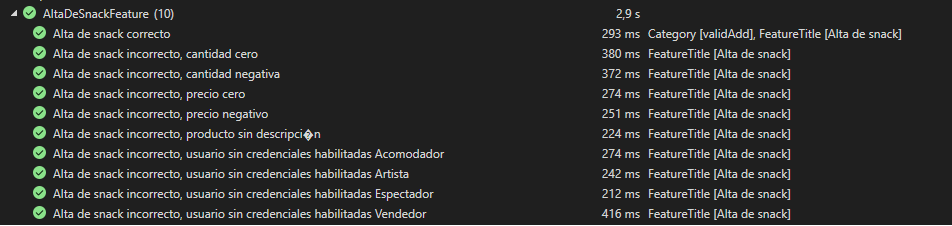
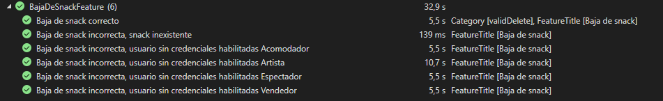
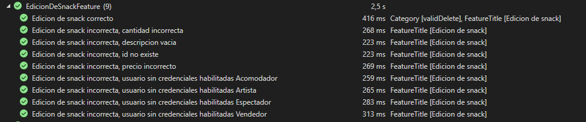
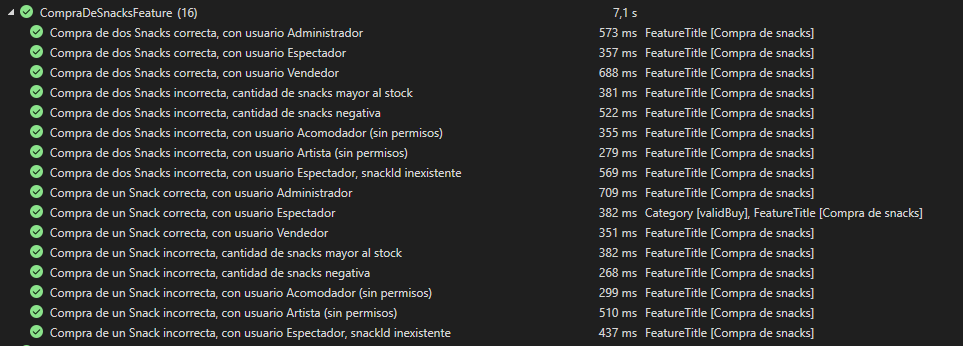
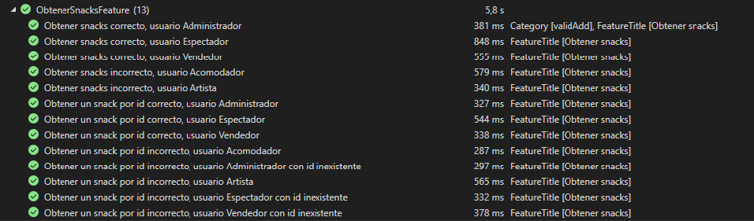

# Evidencia de ejecución de los casos de prueba

A continuación, se adjuntan capturas de pantalla de la ejecución exitosa de todos los casos de prueba realizados para el _back end_ utilizando la herramienta _SpecFlow_ y _Living Documentation_, así como evidencia de pruebas exploratorias realizadas para el _front end_:

## _Back End_

### Alta de Snacks

Diez pruebas ejecutadas exitosamente:

### Baja de Snacks

Seis pruebas ejecutadas exitosamente:

### Edición de Snacks

Nueve pruebas ejecutadas exitosamente:

### Compra de Snacks

Dieciséis pruebas ejecutadas exitosamente:

### Obtener Snacks

Trece pruebas ejecutadas exitosamente:

### Living Documentation

Se adjunta la documentación viva generada por la herramienta _SpecFlow_

## _Front End_

### Pruebas Exploratorias

Los tres participantes del equipo realizamos pruebas exploratorias en el _front end_, siguen los enlaces a cada documento:

- [Denise Souberville](../Evidencia%20ejecucion%20de%20las%20pruebas/PruebasExploratoriasFrontend/Pruebas%20exploratorias%20FrontEnd%20Denise%20Souberville.pdf)
- [Federico Alonso](../Evidencia%20ejecucion%20de%20las%20pruebas/PruebasExploratoriasFrontend/Pruebas%20exploratorias%20FrontEnd%20Federico%20Alonso.pdf)
- [Horacio Abalos](../Evidencia%20ejecucion%20de%20las%20pruebas/PruebasExploratoriasFrontend/Pruebas%20exploratorias%20FrontEnd%20Horcio%20%C3%81balospdf.pdf)
