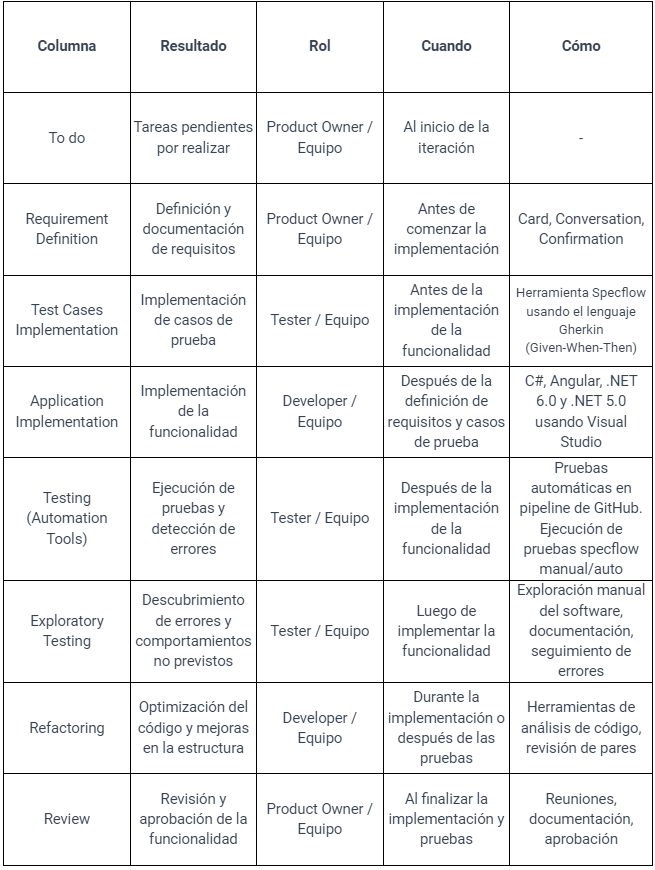
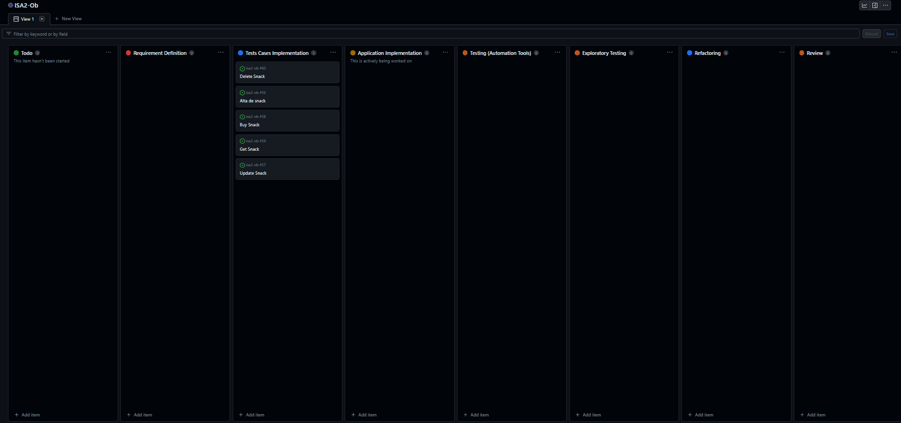

# Explicación del tablero y su vínculo con el proceso de ingeniería

De acuerdo a lo mencionado en las entregas anteriores, el equipo continua implementando dos tableros Kanban, uno para la gestión de la documentación solicitada en cada entrega y de sus tareas administrativas asociadas, y el otro para la gestión tareas asociadas al proceso de desarrollo de funcionalidades y creación de los artefactos correspondientes.

Mantenemos el tablero de gestión anterior con las 3 columnas (Todo, InProgress y Done) sin realizar cambios permitiendonos mantener el orden y una visualización rápida del estado administrativo de la entrega.

En esta instancia continuamos con la evolución de nuestro tablero de kanban dedicado al desarrollo.
Como agregado a la instancia anterior, tenemos que en esta nueva, se presentarán 2 requerimientos nuevos a ser trabajados, por lo que modificaremos el tablero para que se adapte a nuestro trabajo con dichos requerimientos.
Nos basamos en BDD, que es _behaviour driven development_, por lo que nos aseguramos que las _User Stories_ estén enfocadas en el comportamiento del usuario y en las necesidades del negocio. Esto facilita la colaboración entre el equipo de desarrollo y el _Product Owner_, y permite un desarrollo más eficiente y efectivo. Además lo adaptamos a nuestras necesidades, por lo que añadiremos algunos procesos necesarios para nuestro trabajo.

Columna _To do_ (_backlog_): en esta columna se colocan todas las _User Stories_ que deben ser trabajadas. Estas _User Stories_ son priorizadas por el _Product Owner_ y el equipo de desarrollo debe asegurarse de que estén bien definidas y entendidas antes de comenzar a trabajar en ellas.

Columna _Requirement Definition_ en esta columna se realiza la _Card Confirmation Conversation (CCC)_, que es una reunión entre el equipo de desarrollo y el _Product Owner_ para definir y acordar los detalles de cada _User Story_. Durante la CCC, se establecen los criterios de aceptación para que las _User Stories_ puedan ser consideradas Done en la siguiente columna.

Columna _Test Cases Implementation_ en esta columna el equipo de desarrollo escribe los test unitarios basados en los criterios de aceptación definidos en la columna anterior.

Columna _Application Implementation_ en esta columna el equipo escribe el código necesario para convertir los tests unitarios en _Green_. Es decir, para que pasen satisfactoriamente las pruebas realizadas en la columna anterior.

Columna _Testing (Automation Tools)_ en esta columna se realizan pruebas unitarias automáticas utilizando herramientas de automatización de pruebas. De esta forma, se asegura que el código desarrollado cumpla con los criterios de aceptación y se identifican rápidamente errores y defectos que deben ser corregidos.

Columna _Exploratory Testing_ en esta columna se realizan pruebas exploratorias manuales del frontend y se realizan sus respectivos informes.

Columna _Refactoring_ en esta columna se pueden realizar mejoras en el código para que cumpla con las mejores prácticas y se eliminen posibles errores.

Columna _Review_ en esta columna se realiza una revisión final de la _User Story_ por parte del equipo de desarrollo y el _Product Owner_. Se valida que se hayan cumplido todos los criterios de aceptación y que la User Story esté lista para ser considerada _Done_.

En la siguiente tabla podemos ver el detalle del resumen de cada proceso:

## Evolución del tablero y sus issues

A continuación se muestra el detalle de como fueron moviendose las issue durante el desarrollo de la entrega. 

