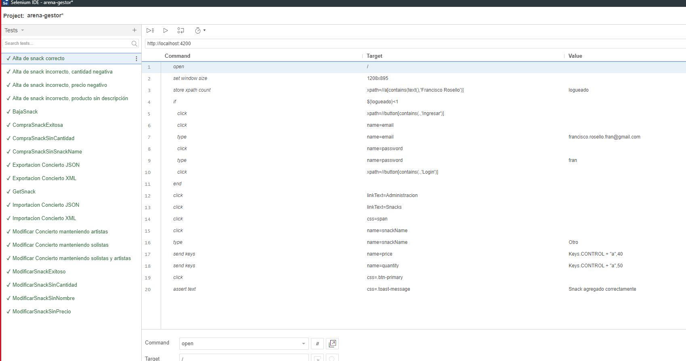
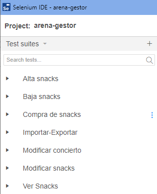

# Evidencia de ejecución de los casos de prueba

A continuación, se adjuntan capturas de pantalla de la ejecución exitosa de todos los casos de prueba realizados para el _front end_ utilizando la herramienta _Spectrum_, tanto de los dos bugs arreglados como de la implementación de las nuevas funcionalidades :

La ejecución de las pruebas también se puede ver en el [Video de demostración al PO](https://fi365-my.sharepoint.com/:v:/g/personal/ha196991_fi365_ort_edu_uy/EQ6cg1oJ9ZNAk_tiBLbFzNkBc_wufT0Ex-IOVVUGKnIAiQ?email=DS223427%40fi365.ort.edu.uy)

Organizamos la separación de los tests en 7 suites distintas:

**Funcionalidad de Alta, Baja y Modificación de Snacks:**

└─Alta snacks

└─Baja snacks

└─Modificar snacks

**Funcionalidad de Compra Snacks:**

└─Compra de snacks

└─Ver snacks

**Bug Importación-Exportación:**

└─Importar-Exportar

**Bug Modificación de concierto:**

└─Modificar concierto

Las pruebas implementadas y ejecutadas en cada una corresponden a los distintos escenarios de las tarjetas escritas en formato BDD realizadas para la tercer entrega, kas que pueden encontrarse siguiendo los siguientes enlaces:

  - [Add Snack Card](../../Entrega%203/Cards%20BDD/Add%20Snack%20Card.md)
  - [Buy Snack Card](../../Entrega%203/Cards%20BDD/Buy%20Snack%20Card.md)
  - [Delete Snack Card](../../Entrega%203/Cards%20BDD/Delete%20Snack%20Card.md)
  - [Get Snack Card](../../Entrega%203/Cards%20BDD/Get%20Snack%20Card.md)
  - [Update Snack Card](../../Entrega%203/Cards%20BDD/Update%20Snack%20Card.md)

  Algunos de los escenarios no pudieron ser implementados debido a limitaciones que se nos presentaron para validar áreas de la interfaz que no tenían permiso por parte de usuarios sin los roles correspondientes.

  Las pruebas no fueron automatizadas en el pipeline de github por dificultades que se nos presentan al tener que hacer un restore de la base de datos de prueba cada vez que se realiza la ejecución de ellas. Sumado a la dificultad para levantar el backend y luego indicar al frontend el puerto autogenerado correspondiente a la API.

  ## Configuración a tener en cuenta
  Para que las pruebas funcionen correctamente debemos tener cargado el archivo .bak que tenemos en la carpeta [DB .bak](../DB%20.bak) y además debemos configurar también el correspondiente connection string en el archivo appsettings de nuestro proyecto API.

  También debemos tener el contenido de la carpeta [ArenaGestorExtensions](../ArenaGestorExtensions) en la ruta C:\ArenaGestorExtensions\ de nuestra máquina.
