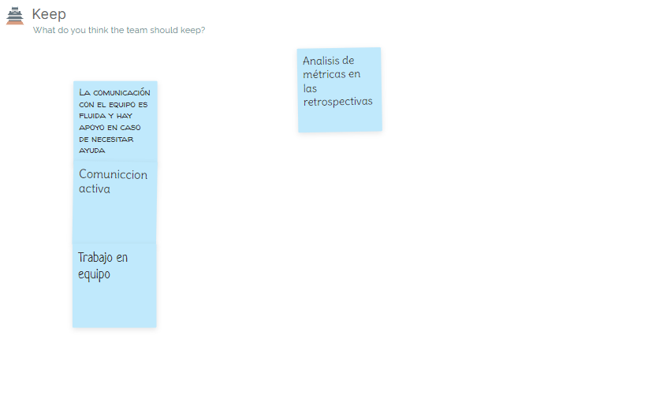

# Informe de Avance de la Etapa

## Lecciones aprendidas

Dejamos el acceso a un histórico de las lecciones aprendidas durante el proyecto, el mismo se encuentra en el siguiente [enlace](./HistoricoLeccionesAprendidas/README.md).

En el transcurso de la etapa detectamos lecciones que aprendimos y queremos destacar en esta sección:

### Movimiento adecuado de tarjetas en tablero

Si se utiliza un tablero de Kanban para la gestión del proyecto debe realizarse seriamente el movimiento de las tarjetas a las diferentes columnas según corresponda a su estado o actividad en curso. En nuestro caso, muchos movimientos de tarjetas no representan la realidad ya que nos olvidábamos de realizar esta tarea. Por lo tanto, debimos reconstruir lo sucedido a través de verificaciones en conversaciones.

### Verificar etapas del proceso de ingeniería

Al aplicarse una gestión del proyecto utilizando kanban, cuando se define el proceso de ingeniería no se deben incluir más etapas de las estrictamente necesarias para dicha iteración. En caso contrarió el vínculo del tablero kanban tendrá columnas que se corresponden con el proceso de ingeniería que no serán utilizadas. Lo anterior fue claramente observable en la segunda entrega cuando definimos un proceso de ingeniería que tenía _Testing Automático_. Esto se reflejó en una columna del tablero kanban que no fue utilizada.

### Análisis de métricas

Si se utiliza una gestión del proyecto ágil (por ejemplo kanban) debe analizarse en cada retrospectiva las métricas asociadas para conseguir feedback rápido y poder instrumentar las mejoras identificadas.

---

## Informe de la retrospectiva

Finalmente, realizamos la retrospectiva utilizando nuevamente el método DAKI (drop, add, keep, improve) para reflexionar sobre nuestro proceso de trabajo y encontrar áreas en las que podríamos mejorar.

En esta ocasión, también se procedió a dejar un tiempo para que cada integrante llene las tarjetas como les quede cómodo, y luego al momento de la conversación se fue complementando cada una de las notas con más detalle, a efecto de que se refleje en el tablero lo conversado en la retrospectiva.

A continuación se adjuntan las imágenes extraídas del tablero de la herramienta _MetroRetro_:

### Tablero DAKI

### Análisis de la retrospectiva

En la sección _Drop_, se destacó la importancia de evitar depender exclusivamente del cronograma de clases para realizar nuestras tareas. Esperar a que un tema sea explicado en clase puede resultar en la pérdida de varios días valiosos, lo cual puede generar una acumulación de trabajo al final. Por lo tanto, se sugiere investigar por nuestra cuenta los temas o tecnologías nuevas al comienzo de cada iteración, de manera que podamos avanzar sin obstáculos.

En la sección de _Add_ hemos identificado dos objetivos principales. En primer lugar, reiteramos la idea planteada en la retrospectiva anterior de la posibilidad de cambiar la herramienta que utilizamos para nuestras retrospectivas. Con la próxima entrega marcando el final del proyecto, consideramos que sería beneficioso investigar otras alternativas y evaluar si podemos encontrar una plantilla o una herramienta diferente a _MetroRetro_ que se adapte mejor a nuestras necesidades.

En segundo lugar, hemos expresado nuestro deseo de celebrar los logros que hemos obtenido a lo largo del proyecto. Sabemos de la importancia de reconocer y valorar el progreso y los resultados positivos alcanzados. Por lo tanto, nos gustaría encontrar una manera significativa de conmemorar y compartir estos logros dentro del equipo.

En la sección _Keep_, hemos destacado nuevamente la importancia de mantener la comunicación fluida y el apoyo en equipo, y hemos agregado un espacio dedicado para discutir el análisis de las métricas de esta iteración, lo que nos permitirá evaluar nuestro progreso de manera efectiva.

En la sección _Improve_ volvió a surgir la discusión de mejorar el mantenimiento del tablero e ir registrando los tiempos, asegurandonos de devolver tarjetas que no se estén trabajando para que no queden en el _WIP_. Otra situación que nos gustaría mejorar es tener más en claro lo que se espera por parte del cuerpo docente en cada entrega, puesto que nosotros asumimos ciertas ideas que luego sobre la fecha de entrega nos al enterarnos de lo que se espera realmente nos cambia el panorama. También nos gustaría continuar y aplicar más las revisiones del trabajo de los otros compañeros, ya que vimos que al realizarlo detectamos errores que de otra forma no hubiésemos detectado. Además otras ideas que surgieron fueron las de aumentar la frecuencia de las retrospectivas, y de tomar nota de las lecciones aprendidas en cuanto las observamos a los efectos de no perderlas.

### Actions

Como resultado de la discusión de la retrospectiva agregamos 3 actions, las que se pueden apreciar en la siguiente imágen:

### Conclusiones

Como conclusión, podemos observar un progreso notable en el manejo de las herramientas de trabajo en equipo y la gestión del proyecto. En cada etapa, hemos sido capaces de agregar lecciones aprendidas que nos han ayudado a mejorar continuamente.

Sin embargo, también reconocemos que hay algunas situaciones que han sido identificadas previamente como áreas de mejora en retrospectivas anteriores y que aún no hemos logrado resolver por completo. A pesar de esto, es importante destacar y valorar la constancia y compromiso que hemos mantenido como equipo a lo largo del proyecto.

Se adjunta el enlace al [video de la retrospectiva.](https://fi365-my.sharepoint.com/:v:/g/personal/ha196991_fi365_ort_edu_uy/EWCKKDuGD5dLlq_Yly2rGx0BkwezyvYUZapYvCmuJho3Rg?email=DS223427%40fi365.ort.edu.uy)
