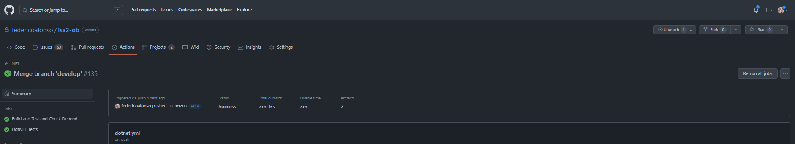

# Guia de instalación para el desarrollo y despliegue en producción

## Introducción

Se presenta la siguiente guía para la instalación del proyecto en cada uno de los entornos de desarrollo y producción. Se asume que el usuario tiene conocimientos básicos de la instalación de los componentes necesarios para el desarrollo y despliegue de la aplicación, además tener las tecnologías necesarias instaladas en su equipo de trabajo (NodeJS, Dotnet 5, Angular CLI, SQL Server).

## Instalación del proyecto

Para el correcto funcionamiento del proyecto, se debe tener la base de datos restaurada en el SQL Server, el archivo de restauración se encuentra en la carpeta `assets\DB\ArenaGestorDB.bak`. Una vez restaurada la base de datos, se debe configurar la cadena de conexión en el archivo `appsettings.json` del proyecto `ArenaGestor.Api`.

Se debe mover la carpeta que se encuentra en `assets\files\ArenaGestorExtensions` a la carpeta `C:\ArenaGestorExtensions` para que el proyecto se pueda ejecutar correctamente, sobre todo la sección de la API que se encarga de la generación de archivos. Como opción se puede ejecutar el archivo GenerarCarpeta.bat que se encuentra en esta carpeta para que se realice la copia de la carpeta automáticamente.

Para correr pruebas unitarias sin el IDE, tenemos configurado el pipeline de Github Actions, el cual se encarga de ejecutar las pruebas unitarias. Para ejecutar las pruebas unitarias en el ambiente local se recomienda abrir el IDE y realizarlo, pero también se puede ejecutar el siguiente comando en la carpeta raíz del proyecto API:

```bash
dotnet test
```

También se pueden correr desde la sección de Actions del repositorio, ya que el pipeline se encarga de ejecutar las pruebas unitarias cada vez que se realizan cambios en el mismo, manualmente si se accede a cualquiera de las ejecuciones se puede presionar en el botón de `Re-run jobs` para que se ejecuten las pruebas unitarias.



Para poder ejecutar los proyectos en el ambiente local, sin la necesidad de abrir el IDE, tenemos los dos archivos .bat que se encuentran en la carpeta, estos archivos se encargan de ejecutar los proyectos de Angular y API respectivamente. Para ejecutarlos se debe hacer doble click en StartBack.bat y StartFront.bat. De esta forma se correrán los proyectos en el puerto 4200 y 5001 respectivamente.

La ejecución de ambos puede ser conveniente para poder ejecutar las pruebas de SpecFlow, ya que estas pruebas se ejecutan en el IDE y se necesita que el proyecto de Backend esté corriendo para que se puedan ejecutar correctamente.

Tras la ejecución de las pruebas es conveniente restaurar la base de datos, ya que en las pruebas se consumen elementos de ella.

Para ejecutar las pruebas de Selenium, basta con tener la base de datos restaurada, y los dos proyectos deben estar corriendo, luego, desde la extensión del navegador se carga el archivo `assets\Selenium\arena-gestor.side` y se ejecutan las mismas.

## Despliegue en producción

No realizamos el despiliegue en producción, por no poseer ningún ambiente de producción donde realizarlo. Pero en caso de poseerlo se puede configurar desde Github Actions, sólo se necesita ampliar el pipeline para que se realice el despliegue en el ambiente de producción, stage o desarrollo. Actualmente sólo lo tenemos configurado para que corra las pruebas unitarias, ya si quisiéramos que corra las pruebas de SpecFlow se debe agregar un ambiente que posea el servicio levantado para que las mismas puedan correr.

Ampliar el pipeline de Github Actions para que pueda desplegar la aplicación conllevaría los siguientes pasos extra:

-   Configurar el archivo `appsettings.json` para que apunte a la base de datos correcta.

-   Realizar el build de las aplicaciones de Angular y API. Esto se puede realizar con los siguientes comandos:

```bash
dotnet build
ng build --prod
```

-   Localizar las carpetas dist generadas en un servidor o contenedor en el lugar correcto para que se pueda acceder a las mismas.

-  En caso de que sean contenedores, desplegar los mismos en el ambiente seleccionado.

En ninguno de estos casos se necesita la intervención del usuario, ya que el pipeline se encarga de realizar todos estos pasos automáticamente. El mismo puede correr cuando se realizan cambios en el repositorio, o se puede ejecutar manualmente desde la sección de Actions en Github.